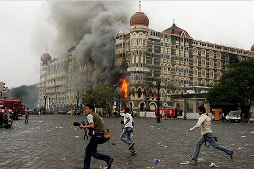

# Introduction

In this repository, you will find information of different projects that I have worked on. Each project includes different sections such as, problem statement, Dataset introduction, Results and Future recommendations.

# List of Projects

## 1) The Health Insurance Marketplace Analysis

Using several machine learning algorithms and different python techniques to response to several questions including: How do plan rates vary across states? How did plan rates change from 2014 to 2016? How do plan rates vary with additional family? How do plan rates vary by age? How do plan rates vary between smokers and non-smokers? [Read more ...](https://github.com/ParisaGY/Portfolio/tree/master/projects/Health-insurance)
 

## 2) West Nile Virus Prediction

West Nile Virus (WNV) can cause severe illness. The disease can be spread by mosquito bites. In this project, I predicted the presence of WNV in different trap locations at different times of the year in Chicago by using several machine learning algorithms. The results help the Chicago Department of Public Health to allocate resources more efficiently and effectively towards preventing transmission of this potentially deadly virus by spraying the correct location on time. [Read more ...](https://github.com/ParisaGY/Portfolio/tree/master/projects/WNV)

!Mosquito-bloodfed-P7310068](Mosquito-bloodfed-P7310068.png)
## 3) Iowa Liquor Store Research

The Iowa State legislature is considering changes in the liquor tax rates and wants a report of current liquor sales by county and projections for the rest of the year. In this project, I used different stat. models to predict the total sale of liquor stores in state of Iowa. [Read more ...](https://github.com/ParisaGY/Portfolio/tree/master/projects/Iowa%20liquor%20store)

## 4) Data Scientist Salary Prediction

Natural language processing techniques was used to scrap the indeed website for data scientist and data analyst positions in large cities including NY, DC, SF. Several techniques were used to predict the salary for these positions based on qualifications, location and some phrases in the job title. [Read more ...](https://github.com/ParisaGY/Portfolio/tree/master/projects/NLP)

## 5) Violation Attack Analysis

Exploring the Global Terrorism Database (GTD) to impute the number of people killed based on terrorist attach that occurred in 1993, and using Bayesian inference to compare two different populations to know if the amount of terror one area has seen differs in a significant way than another area. [Read more ...](https://github.com/ParisaGY/Portfolio/tree/master/projects/Violation%20attack)

## 6) Exploring SAT scores around the United State

Exploring SAT scores around the United States with different python libraries like Matplotlib, NumPy and seaborn to create visualizations. [Read more ...] (https://github.com/ParisaGY/Portfolio/tree/master/projects/SAT%20Score)

You will find more information about each project in the following pages.

